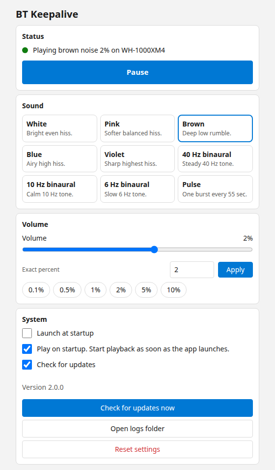

#  BT KeepAlive

[](https://github.com/kadato/bt-keepalive/actions/workflows/ci.yml)
[](https://github.com/kadato/bt-keepalive/releases/latest)
[](LICENSE)

Bluetooth headphones on Windows sleep after seconds of silence. The next sound then loses its first second. BT KeepAlive plays sound you barely hear so the link stays open.

<picture>
  <source media="(prefers-color-scheme: dark)" srcset="docs/screenshots/settings-dark.png">
  
</picture>

## Download and install

Download the latest build from the [releases page](https://github.com/kadato/bt-keepalive/releases/latest), or use the direct links below. Every release ships with `SHA256SUMS.txt`.

| Platform | Package | Notes |
|----------|---------|-------|
| Windows | [](https://github.com/kadato/bt-keepalive/releases/latest/download/BTKeepAlive-setup.exe) | Installer with Start menu entry. Recommended |
| Windows | [](https://github.com/kadato/bt-keepalive/releases/latest/download/BTKeepAlive-portable.zip) | Portable. Extract and run |

You need Windows 10 or 11.

### Installer, recommended

1. Download `BTKeepAlive-setup.exe` from the table above.
2. Run the setup. The app lands in `%LOCALAPPDATA%\Programs\BTKeepAlive\`.
3. Start BT KeepAlive from the Start menu. A tray icon appears.
4. To start the app on every boot, open Settings and turn on **Launch at startup**.

### Portable

1. Download `BTKeepAlive-portable.zip` from the table above.
2. Extract both files to one permanent folder and keep them together.

- `BTKeepAlive.exe`
- `WebView2Loader.dll`

> [!WARNING]
> The exe does not start without `WebView2Loader.dll` in the same folder. The DLL ships with every Tauri WebView2 app and is not optional.

### One-line install

Run this in PowerShell. It downloads the latest setup and runs it.

```powershell
irm https://raw.githubusercontent.com/kadato/bt-keepalive/main/install.ps1 | iex
```

For a portable copy with the same script:

```powershell
.\install.ps1 -Portable -Dest "$env:USERPROFILE\Apps\BTKeepAlive"
```

> [!NOTE]
> SmartScreen may warn about an unsigned build. Pick **More info** and then **Run anyway**.

To verify a download, compare its hash with `SHA256SUMS.txt` on the release page.

```powershell
Get-FileHash "$env:USERPROFILE\Downloads\BTKeepAlive-setup.exe" -Algorithm SHA256
```

## Use the app

Left-click the tray icon to open Settings. Right-click the tray icon for the short menu: **Play or Pause**, **Settings**, **Check for updates**, **Open logs folder**, **Quit**.

 Playing.  Paused.

The Settings window has four cards.

- **Status.** Shows what plays, on which device, at what level, with the **Play** or **Pause** button next to it. An update banner appears here when a new release exists.
- **Sound.** Picks one of eight presets: white, pink, brown, blue, violet, and 40, 10, and 6 Hz binaural. Picking a preset returns to continuous mode. The **Pulse** tile switches to one short pulse every 55 seconds while playing.
- **Volume.** Drags a slider, types an exact percent, or picks a quick chip: 0.1, 0.5, 1, 2, 5, or 10 percent. The carrier row appears only for the binaural presets.
- **System.** Toggles launch at startup, play on startup, and update checks. It also holds the version line, the manual update check, the logs button, and the reset button.

### Pick continuous or pulse

**Continuous** is the default. The app plays brown noise at 2 percent, usually inaudible at normal distance.

**Pulse** sends a 1 second pulse every 55 seconds and closes the audio stream between pulses. Pick pulse when you want almost no audible output.

> [!TIP]
> If Bluetooth still drops in pulse mode, lower `pulse_interval_sec` in `config.json`.

## Read config and logs

Settings live in `%APPDATA%\BTKeepAlive\`.

| File | Purpose |
|------|---------|
| `config.json` | Preset, volume, pulse timing, autoplay, and flags |
| `app.log` | Application and audio errors |

Before you edit `config.json`, pause the app. The app saves settings on change, so an open editor can lose to the next save.

| Key | Default | Where to change it |
|-----|---------|--------------------|
| `preset` | `brown` | Sound card |
| `volume` | `0.02` | Volume card |
| `carrier_hz` | `200` | Carrier row, binaural only |
| `keepalive_mode` | `continuous` | Sound card **Pulse** tile |
| `pulse_interval_sec` | `55` | `config.json` only |
| `pulse_duration_sec` | `1` | `config.json` only |
| `pulse_amplitude` | `0.0001` | `config.json` only |
| `autoplay` | `true` | System card as **Play on startup**, or `--no-autoplay`. Starts playback at launch when true. |
| `launch_at_startup` | `false` | System card |
| `playing` | `true` | Status card **Play** or **Pause** button |
| `check_for_updates` | `true` | System card |

## Fix common problems

- If the app exits on start with no sound, check the default playback device in Windows sound settings. Then read `app.log`.
- If you see two icons or an already running message, a copy is already in the tray. Right-click it and pick **Quit**.
- If the startup toggle fails, run the app as your normal user, not as admin. Then read `app.log`.
- If antivirus blocks the exe, allowlist the install folder or build from source.

## Build from source

You need Windows 10 or 11, Rust stable, and Inno Setup 6 for the installer.

```powershell
git clone https://github.com/kadato/bt-keepalive.git
cd bt-keepalive
cargo build --release -p btkeepalive-app
```

Copy the WebView2 loader next to the exe before you run or ship it. `cargo build` does not do this for you.

```powershell
$loader = Get-ChildItem -Path target\release\build -Recurse -Filter WebView2Loader.dll | Where-Object { $_.FullName -match 'x64' } | Select-Object -First 1
Copy-Item $loader.FullName target\release\WebView2Loader.dll
.\target\release\BTKeepAlive.exe --version
```

Build the installer with Inno Setup.

```powershell
iscc installer\BTKeepAlive.iss
```

The file lands in `dist\BTKeepAlive-setup.exe`.

### Check quality gates

Run all four gates from the repo root before you push.

```powershell
cargo fmt --all -- --check
cargo clippy --workspace --all-targets -- -D warnings
cargo test --workspace
node --check btkeepalive-app/settings-ui/main.js
```

Windows-only code uses `cfg(target_os = "windows")`. CI compiles that code with `cargo check --target x86_64-pc-windows-msvc` on every push. Full runs, headset tests, and the installer build happen on Windows.

### Use the CLI

```powershell
.\target\release\BTKeepAlive.exe --version
.\target\release\BTKeepAlive.exe --config-path
.\target\release\BTKeepAlive.exe --no-autoplay
.\target\release\BTKeepAlive.exe --list-devices
.\target\release\BTKeepAlive.exe --render-wav $env:TEMP\smoke.wav
```

`--render-wav` writes 5 seconds of the current preset to a WAV file and exits. `--dry-run` renders to a temp file instead.

### Publish a release

Tag the commit to trigger the release workflow. The workflow builds the exe and the installer, publishes them to the GitHub Release for the tag, and uploads checksums.

```powershell
git tag v2.0.0
git push origin v2.0.0
```

Find past changes in [CHANGELOG.md](CHANGELOG.md). To report a bug, open an issue in the [issue tracker](https://github.com/kadato/bt-keepalive/issues).

### How the code is laid out

- `btkeepalive-core` holds portable logic: config, volume, DSP noise, binaural beats, pulse timing. It builds and tests anywhere.
- `btkeepalive-audio` holds precomputed DSP tables, the lock-free render model, the pulse scheduler, and WAV export. Windows adds the `cpal` output stream.
- `btkeepalive-platform` holds the single-instance mutex, the Run-key startup code, and the event-driven device watcher. Other platforms get stubs for test builds.
- `btkeepalive-app` holds the `BTKeepAlive` binary: CLI, shared state, updater, tray, and the Tauri settings window in `settings-ui` with vanilla HTML, CSS, and JS.

### How the engine works

The audio engine precomputes 10 seconds per preset once, then loops the table in the output callback. The callback reads the volume from an atomic and never blocks on a lock, so the UI thread cannot stall audio. Tables rebuild off thread when the preset, the carrier, or the mode changes. The pulse scheduler closes the stream between bursts and wakes about 0.5 s early. Device switches arrive as system events and reopen the stream. Config saves debounce 500 ms through a sweeper thread.
